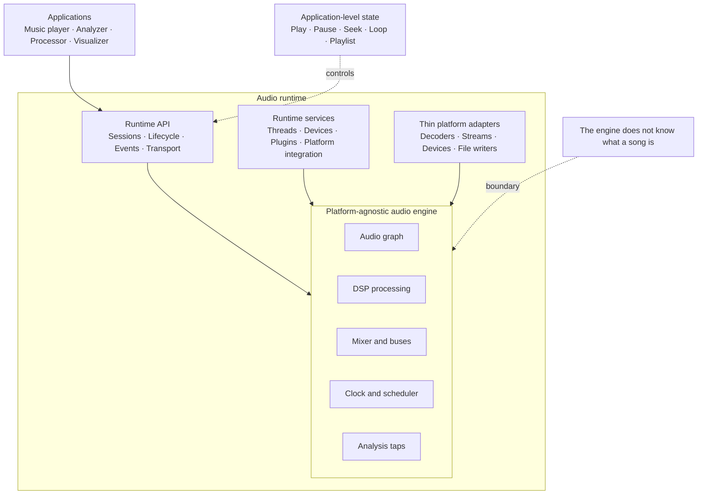
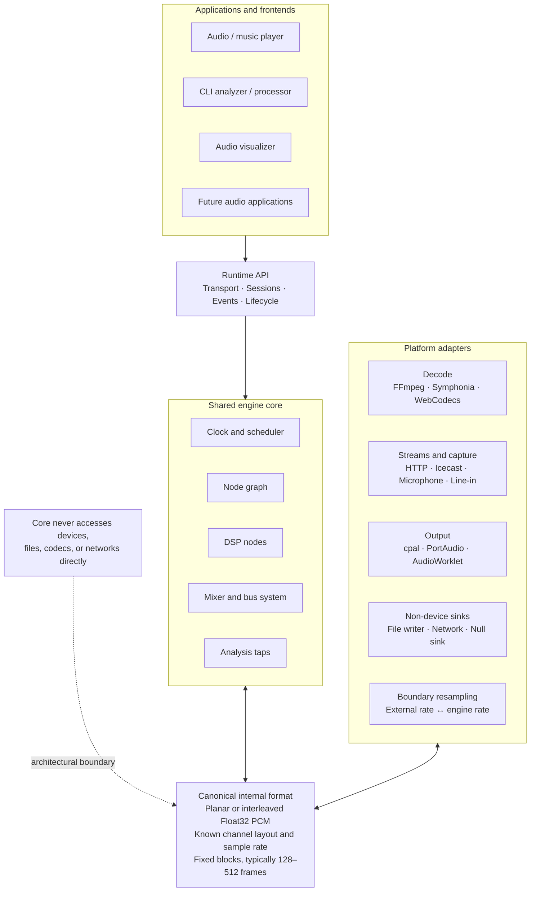
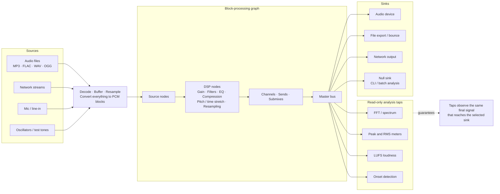
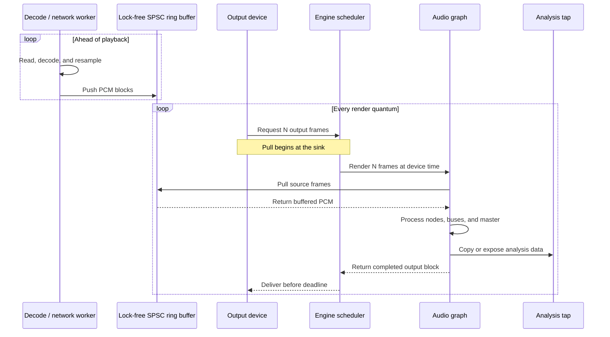
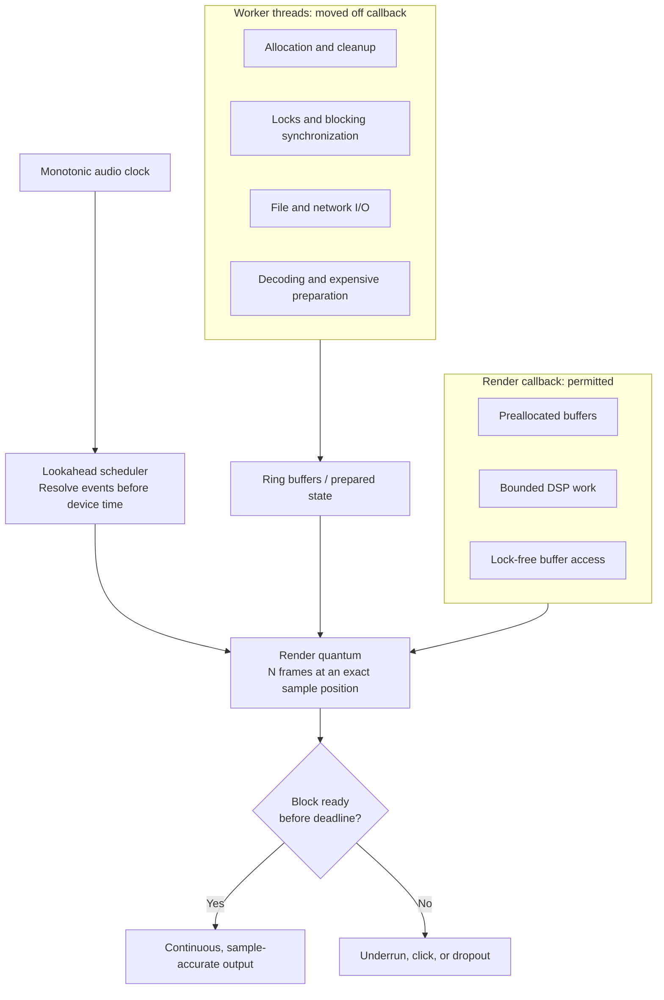
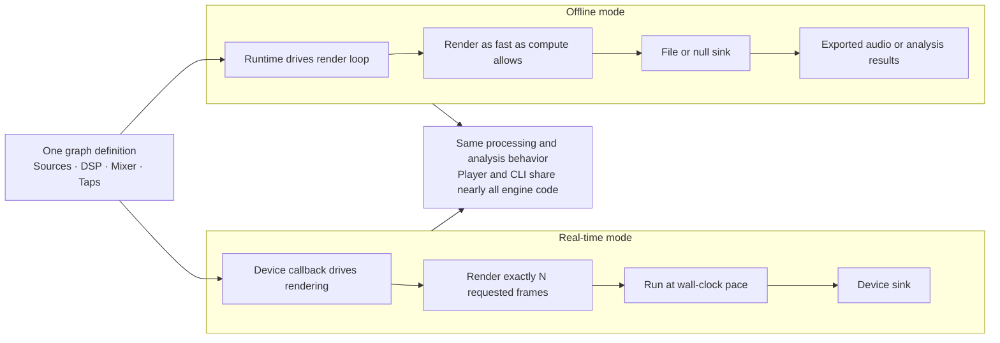
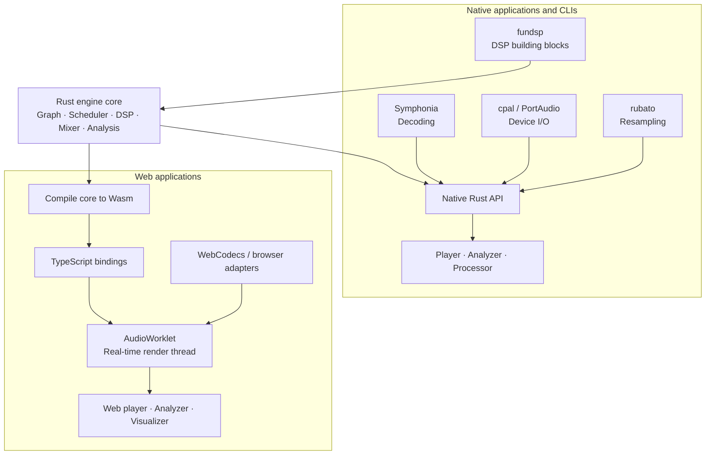
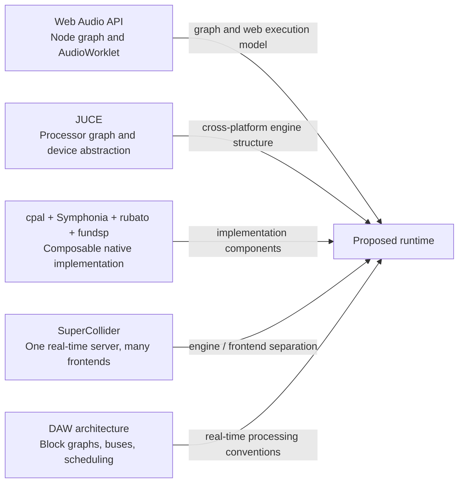

# Audio engine and runtime architecture

Date: 2026-07-31
Link: https://t3.chat/share/egrgp1acd7

This note records the foundational architecture for a reusable core audio library that can power
web audio applications, native applications, and CLIs. The intended consumers include an audio or
music player, an audio analyzer or processor, and an audio visualizer. The system needs to handle
both files and streams while sharing as much implementation as possible across hosts.

## Engine vs. runtime

- **Audio engine**: the thing that *does* audio—decoding, mixing, processing, scheduling, and
  output. Think of it as a library with a graph of nodes and a clock.
- **Audio runtime**: the engine plus the environment it runs in—thread management, device
  abstraction, plugin loading, and lifecycle management.

One core powering players, analyzers, and visualizers across web and native hosts is closer to a
runtime. The engine is its heart; the runtime is everything that lets it live in different hosts.
In practice, the terms are often used loosely. The important design boundary is a
**platform-agnostic engine core** surrounded by **thin platform adapters**.

## Core components

1. **Sources and inputs**: file decoders for formats such as MP3, FLAC, WAV, and OGG; stream
   readers for network streams, microphones, and line-in; and generators such as oscillators and
   test tones. All sources emit the same representation: buffers of PCM samples.
2. **The graph**: nodes such as sources, effects, mixers, and analyzers connected by edges. Each
   node pulls or receives fixed-size blocks of audio, typically 128–512 frames. This is the model
   used by the Web Audio API and, in related forms, JUCE, SuperCollider, and most DAW internals.
3. **The clock and scheduler**: audio is fundamentally time-driven. A render callback fires every
   N frames, and all work must finish before its deadline or the output glitches. Lookahead
   scheduling computes events ahead of device time to provide sample-accurate timing.
4. **Processing and DSP**: gain, filters, EQ, compression, resampling, pitch shifting, and time
   stretching. These are ideally pure operations over sample blocks.
5. **Analysis taps**: FFT, level metering, loudness measurement in LUFS, and onset detection.
   These observe the graph without modifying it. First-class tap points let a visualizer or
   analyzer see exactly what the listener hears.
6. **Mixer and bus system**: channels, sends, submixes, and a master bus.
7. **Outputs and sinks**: an audio device, file writer for bounce or export, network stream, or a
   null sink for offline and batch processing. A CLI analyzer can use a null sink.
8. **Transport and application state**: play, pause, seek, position, looping, and playlists. This
   sits above the engine; the engine itself should not know what a song is.

## Canonical data flow

For each render quantum, the canonical signal flow is:

```text
Sources -> decode/resample -> graph processing block by block
        -> mixer/buses -> analysis taps -> sink: device, file, network, or null
```

There are two principal execution models:

- **Pull or callback-driven**: the output device asks for N frames, and the request propagates
  backward through the graph. Real-time output must work this way. Examples include Web Audio
  `AudioWorklet`, Core Audio, WASAPI, and PortAudio.
- **Push**: sources push data forward. This works for streams and offline processing but is
  awkward for device output.

Most engines are pull-based at the output and accept push-like stream inputs. A lock-free
single-producer, single-consumer ring buffer bridges the two models and moves audio between threads
without locking the real-time callback.

## Target architecture

```text
┌─────────────────────────────────────────────┐
│  Apps: player UI, visualizer, CLI analyzer  │
├─────────────────────────────────────────────┤
│  Runtime API: transport, sessions, events   │
├─────────────────────────────────────────────┤
│  Engine core (pure, platform-agnostic):     │
│  graph, DSP nodes, mixer, scheduler, taps   │
├─────────────────────────────────────────────┤
│  Adapters:                                  │
│  decode:  ffmpeg / symphonia / WebCodecs    │
│  output:  cpal|PortAudio / Web AudioWorklet │
│  streams: HTTP, Icecast, mic                │
└─────────────────────────────────────────────┘
```

The architecture depends on several rules:

- **The core never touches a device or file format directly.** It speaks one language: interleaved
  or planar `Float32` PCM blocks at a known sample rate. Everything else is an adapter.
- **The render callback never allocates, locks, or performs I/O.** Decoding and streaming happen
  on worker threads that feed ring buffers.
- **Sample-rate conversion happens at the boundaries.** The engine runs at one internal rate;
  adapters convert to and from external rates.
- **Analysis is implemented as first-class tap points, not as a separate pipeline.** This ensures
  the visualizer sees exactly what the player outputs.
- **Offline mode uses the same graph.** A null or file sink replaces the device, and the engine
  renders as fast as possible. This lets the CLI analyzer and player share nearly all engine code.

## Reference points

- **Web Audio API**: the node-graph model and `AudioWorklet` render-thread execution.
- **JUCE**: the classic cross-platform engine archetype, especially `AudioProcessorGraph` and its
  device abstraction.
- **cpal + Symphonia + rubato + fundsp**: a composable Rust stack for device I/O, decoding,
  resampling, and DSP respectively.
- **SuperCollider**: separates the language/runtime, `sclang`, from the real-time server,
  `scsynth`, over OSC. This is a useful model for one engine serving many frontends.

## Suggested implementation direction

A strong implementation path is to write the engine core in Rust, using components such as cpal,
Symphonia, rubato, and fundsp. The same core can be linked natively for CLIs and compiled to
WebAssembly for web applications, where it runs inside an `AudioWorklet` and is exposed through
TypeScript bindings. This provides one actual core across both environments. A pure TypeScript
core can work well for the web, but it is likely to require a rewrite or substantial bridging for
native applications.

## Architecture diagrams

### 1. Engine, runtime, and applications



### 2. Layered cross-platform architecture



### 3. Unified signal graph and data flow



### 4. Real-time pull rendering with push-fed inputs



### 5. Clock, scheduling, and real-time discipline



### 6. One graph, two execution modes



### 7. Shared Rust core across native and web hosts



### 8. Architectural reference map


