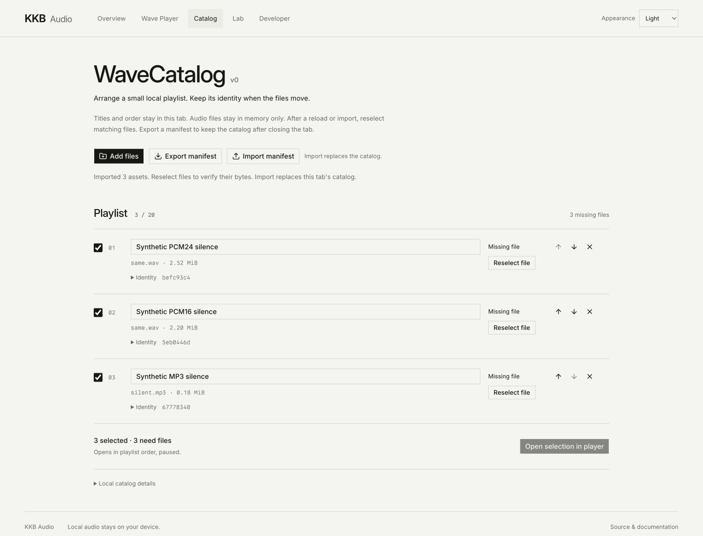
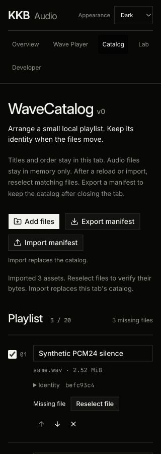
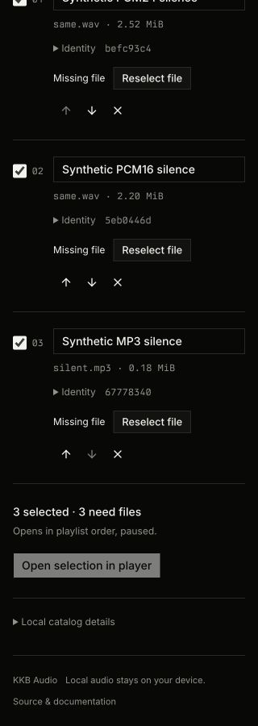

# WaveCatalog v0

`/catalog` is a local experiment built on the Next.js frontend in #36. It follows
the [architecture's asset, revision and locator distinctions](2026-08-28-kkb-audio-system-architecture.md#media-identity-and-revision-recognition).
The account-backed production catalog in that architecture remains future work.

## Behavior

- Add selected WAV/MP3 files, edit titles, choose tracks, and move rows with labelled
  up/down buttons. Duplicate filenames and duplicate bytes can represent separate assets.
- Export `wavecatalog-v1.json`. Import validates the entire manifest before replacing
  the catalog, preserves IDs/titles/order, and clears all File bindings.
- Metadata survives reload in this tab's `sessionStorage`. File access never does.
  Missing rows require explicit reselection. A renamed file binds if its exact
  bytes match. Changed bytes must be added as a new asset in v0.
- Open selection mounts the existing Wave Player with the current ordered subset.
  The first track prepares paused. Play is explicit; previous/next retain the
  existing intent rules. Returning or route unmount closes the playback owner.
  Edits in the player's temporary library do not edit catalog metadata.

## Identity and limits

The manifest has `format: "wavecatalog"`, `version: 1`, and an ordered `assets`
array. Each asset contains a UUID `id`, `title`, and a `revision` with
`id: "sha256:<64 lowercase hexadecimal digits>"`, `byteLength`, and `filename`.
The filename is a display/reselection hint. No locator, file content, or permission
is serialized. V0 keeps one immutable revision per asset and does not infer
recording equivalence or support revision replacement.

Selection is limited to 20 assets, 32 MiB per file, and 128 MiB across the catalog.
All admission limits are checked before reads. Hashing is sequential with at most
one selected file's encoded buffer at a time. Leaving the route aborts remaining
work; an in-flight Web Crypto digest can finish but cannot publish state. Manifest
input is capped at 128 KiB. Unknown fields/versions, malformed IDs, repeated asset
IDs, conflicting lengths for one digest, invalid names/titles, and invalid sizes
are rejected. Exact duplicate revisions with distinct asset IDs are valid.

Admission checks extension and size; the existing Rust/Wasm player validates audio
on opening. This branch uses PCM16/24 WAV and MPEG-1 Layer III MP3 support from #36,
with its existing channel/rate/duration constraints. The separate float32 work is
not a dependency. No auth, backend, upload, cloud storage, directory scan, or new
playback implementation is introduced.

## Design

This is an Operate extension of the existing KKB interface. The task fixes the
structure: a local-files toolbar, editable ordered rows, explicit binding states,
and a paused player handoff. Inter, TX-02, square controls, neutral theme tokens,
and the existing P31 preset remain unchanged. Identity details expand within each
row. The narrow layout puts binding and reorder controls below the title.

## Verification

The focused model tests cover a known SHA-256 vector, changed bytes of the same
length, renamed rebinds, duplicate filenames/bytes, title/order/ID roundtrips,
invalid manifests, pre-read bounds and cancellation. UI tests cover metadata-only
restoration, atomic invalid import, missing selection, rebind rejection/recovery,
and separate player transports with unmount disposal. Catalog and player UI tests
run in separate Bun processes because their Happy DOM globals must not share
Testing Library's cached document and act environment.

Development browser checks used synthetic silent PCM16/24 and MP3 files, including
two different files called `same.wav`. Export/import and reload preserved identities
and order but required rebinds. Same-length changed bytes failed; renamed original
bytes succeeded. The first track opened paused, explicit Play advanced media, and
next/previous used the existing player. Keyboard editing and opening, 320px layout,
and light/dark themes were exercised. Next.js reported no compilation or runtime
errors. These checks do not establish audible quality or broad device support.

`PATH="$PWD/node_modules/.bin:$PATH" bun run check` passed the complete TypeScript,
actual-Wasm, worker, player, catalog, and worklet checks with Bun 1.4.0. The final
cancellation test and catalog UI test also passed after the full run, followed by
typecheck. `PATH="$PWD/node_modules/.bin:$PATH" bun run build` passed on the
published #36 base `0b51940213161a463dbdfe31f08bc3288924bf2d`.

Production checks at `localhost` repeated manifest import, explicit rebind, opening
an ordered subset paused, explicit playback, and route cleanup. Returning to the
catalog restored metadata with missing files. Runtime assets loaded successfully;
the browser reported no warnings or errors. The final light desktop and dark 320px
captures contain only synthetic media. The visual finish review returned `ship`
after correcting filename typography and first-viewport captures. Both temporary
servers exited and ports 3186 and 3187 were verified closed.

